# Fog-Resilient Mine Safety Detection (YOLOv8)

A CCTV-based object detector that flags **humans**, **vehicles**, and **obstacles** in mine environments, fine-tuned specifically to remain reliable in **fog and low-visibility conditions**. Built on YOLOv8n and fine-tuned from COCO-pretrained weights.

This detector is one component of a larger safety pipeline: it identifies *what* and *where* , it in object or HEMM localization . Another part is weather classsifier model.


### OUR PROTOTYPE MODEL

</style>
<table border="1" class="dataframe">
  <thead>
    <tr style="text-align: right;">
      <th></th>
      <th>Metric</th>
      <th>Value</th>
    </tr>
  </thead>
  <tbody>
    <tr>
      <th>0</th>
      <td>Model</td>
      <td>YOLOv8n</td>
    </tr>
    <tr>
      <th>1</th>
      <td>Dataset</td>
      <td>ThroughTheFog_full</td>
    </tr>
    <tr>
      <th>2</th>
      <td>Train images</td>
      <td>8906</td>
    </tr>
    <tr>
      <th>3</th>
      <td>Validation images</td>
      <td>2544</td>
    </tr>
    <tr>
      <th>4</th>
      <td>Test images</td>
      <td>1273</td>
    </tr>
    <tr>
      <th>5</th>
      <td>Classes</td>
      <td>human, vehicle, obstacle</td>
    </tr>
    <tr>
      <th>6</th>
      <td>Image size</td>
      <td>640</td>
    </tr>
    <tr>
      <th>7</th>
      <td>Epochs</td>
      <td>20</td>
    </tr>
    <tr>
      <th>8</th>
      <td>Device</td>
      <td>CPU</td>
    </tr>
    <tr>
      <th>9</th>
      <td>Precision</td>
      <td>0.578793</td>
    </tr>
    <tr>
      <th>10</th>
      <td>Recall</td>
      <td>0.44873</td>
    </tr>
    <tr>
      <th>11</th>
      <td>mAP@0.50</td>
      <td>0.494151</td>
    </tr>
    <tr>
      <th>12</th>
      <td>mAP@0.50:0.95</td>
      <td>0.311439</td>
    </tr>
  </tbody>
</table>
</div> 


## Results

### Real-World Detection Results

<table>
  <tr>
    <td>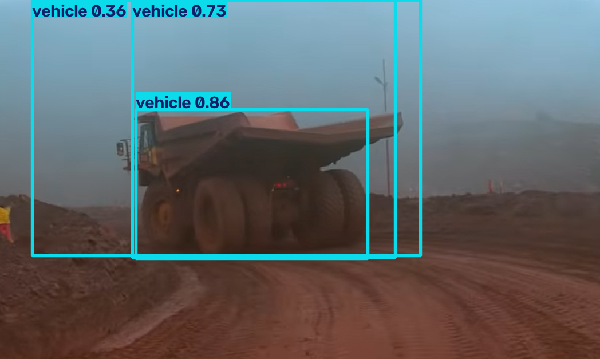</td>
    <td>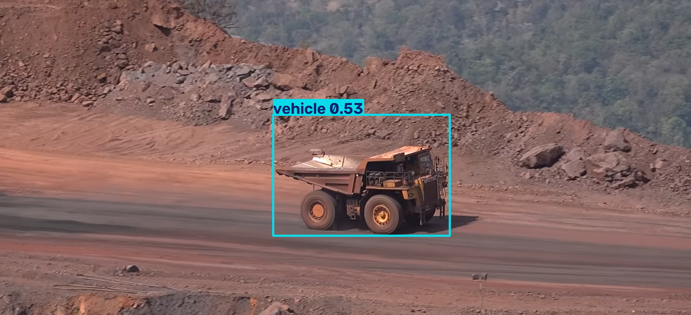</td>
    <td>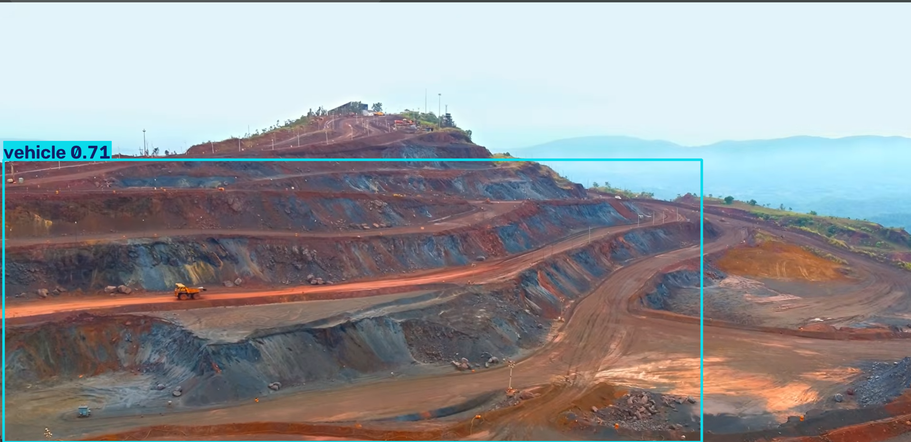</td>
    </tr>
  <tr>
    <td>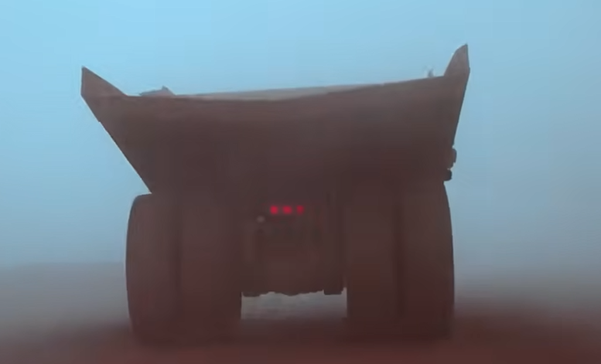</td>
    <td>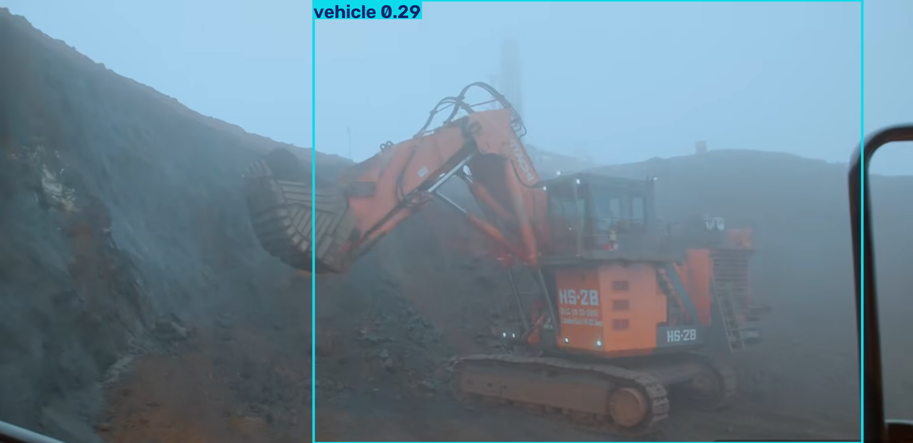</td>
    <td>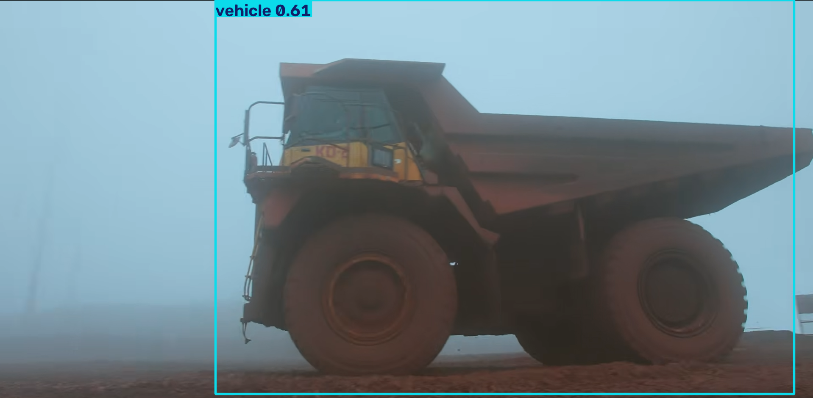</td>
  </tr>
  <tr>
    <td>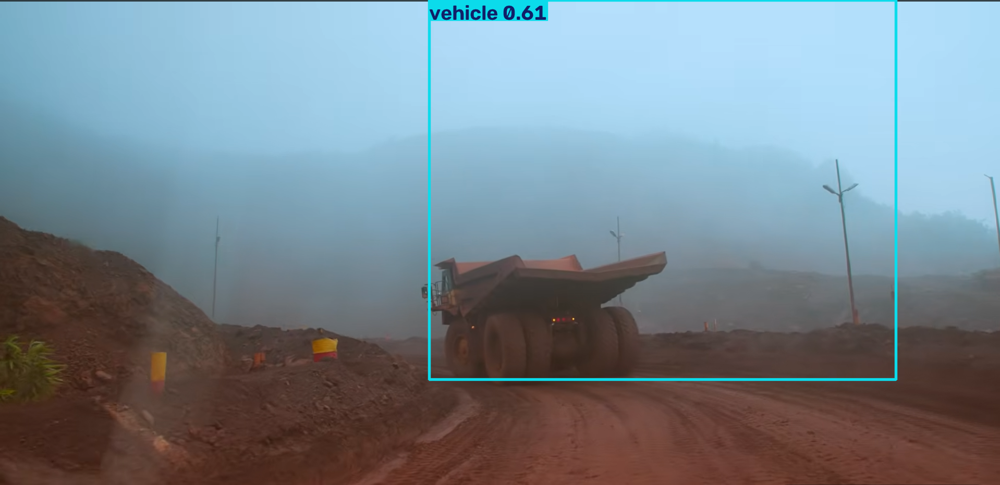</td>
    <td>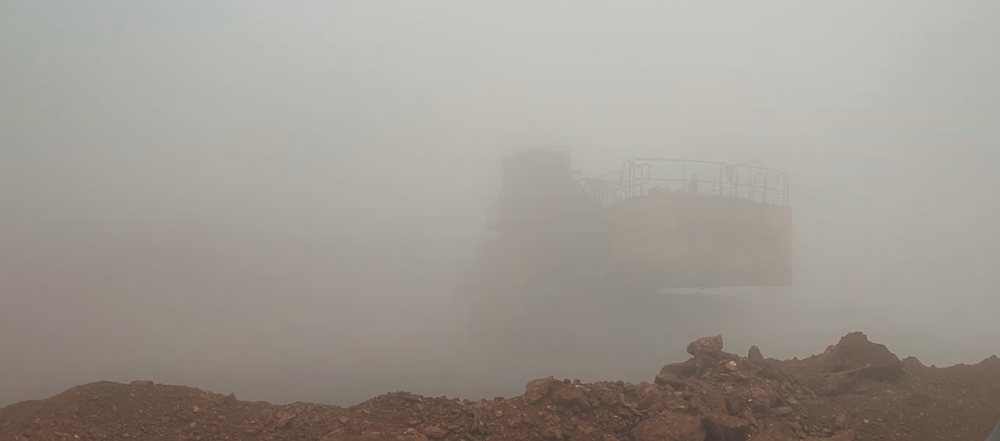</td>
    <td>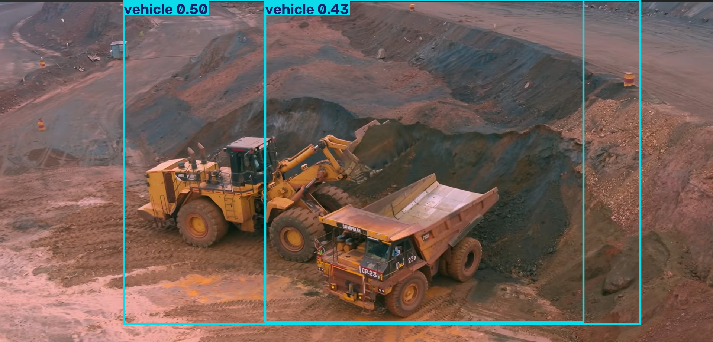</td>
  </tr>
  <tr>
    <td>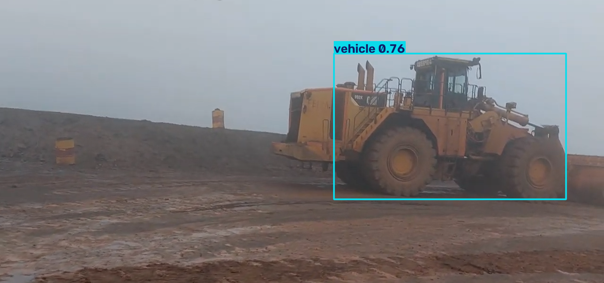</td>
    <td>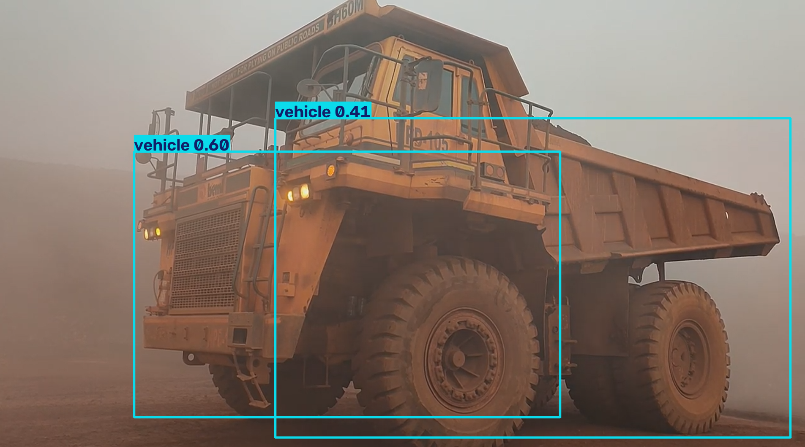</td>
    <td>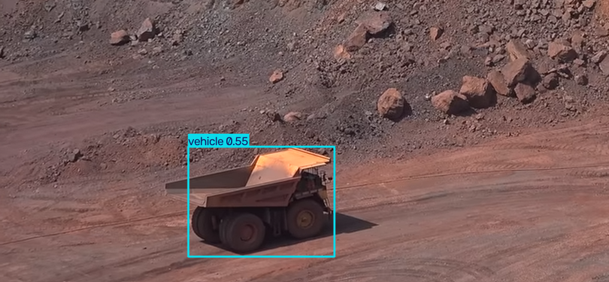</td>
  </tr>
</table>

## Architecture


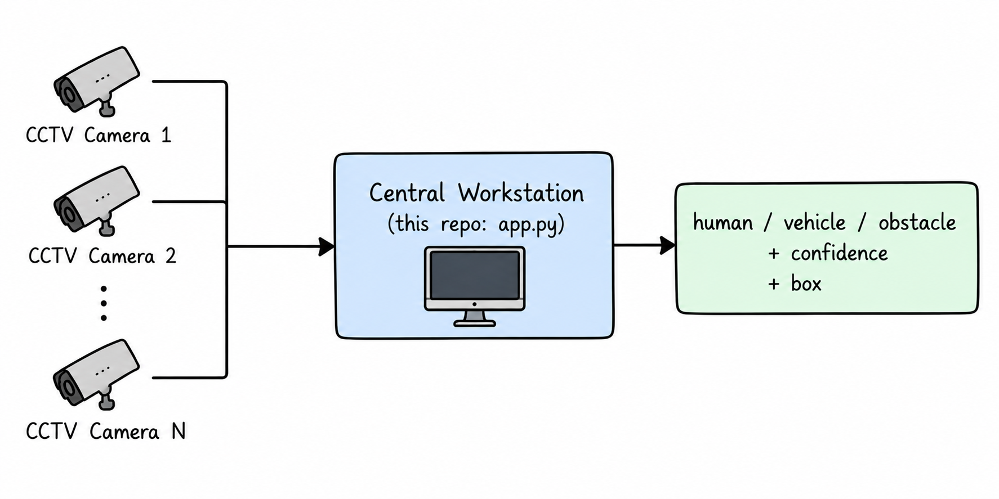

Unlike a per-camera "edge device" setup, **all camera feeds are streamed to one central workstation**, which runs this repo's `app.py` as a single backend service watching every feed concurrently (see `src/infer_stream.py`).


## DATASET 
### Seeing Through Fog (STF)

The **Seeing Through Fog (STF)** dataset was introduced by Bijelic et al. in *"Seeing Through Fog Without Seeing Fog: Deep Multimodal Sensor Fusion in Unseen Adverse Weather"* (CVPR 2020). It is a multimodal adverse-weather object detection dataset containing real-world driving scenes and controlled fog-chamber recordings across **fog, rain, and snow** conditions. The dataset contains approximately **12,000 real-world samples and 1,500 controlled fog-chamber samples**, with multimodal data from RGB cameras, LiDAR, radar, gated NIR, and FIR sensors. :contentReference[oaicite:1]{index=1}

The original object annotations contain the following classes:

| Original Class |
|---|
| Pedestrian |
| Truck |
| Car |
| Cyclist |
| DontCare |

The dataset also provides fallback object categories in cases where finer-grained classification is not possible, including **Vehicle** and **Obstacle**. :contentReference[oaicite:2]{index=2}

### Class Conversion

For our mine-deployment scenario, the available classes were consolidated into **three deployment-specific classes**:

| New Class ID | Our Class | Original Classes Mapped |
|---:|---|---|
| 0 | Human | Pedestrian |
| 1 | Vehicle | Car, Truck, Cyclist, Vehicle |
| 2 | Obstacle | Obstacle |
 
The `DontCare` class was not used as a target class.

This conversion aligns the dataset taxonomy with our target deployment, where the detector needs to identify **HEMM vehicles, pedestrians, and other obstacles** under adverse visibility conditions.

### Dataset Split

| Split | Images | Labels |
|---|---:|---:|
| Train | 8,906 | 8,906 |
| Validation | 2,544 | 2,544 |
| Test | 1,273 | 1,273 |
| **Total** | **12,723** | **12,723** |

### Object Distribution

| Split | Human | Vehicle | Obstacle |
|---|---:|---:|---:|
| Train | 28,442 | 43,032 | 1,651 |
| Validation | 7,963 | 11,812 | 424 |
| **Train + Validation** | **36,405** | **54,844** | **2,075** |

### Annotation Quality

```text
TRAIN
Human       : 28,442 objects
Vehicle     : 43,032 objects
Obstacle    : 1,651 objects
Malformed   : 0
Invalid IDs : 0

VAL
Human       : 7,963 objects
Vehicle     : 11,812 objects
Obstacle    : 424 objects
Malformed   : 0
Invalid IDs : 0

```
## Repository structure

```text
fog_mine_yolov8/
├── app.py                    # FastAPI backend - the central inference service
├── config.py                 # every path/constant/hyperparameter, in one place
├── requirements.txt
├── .gitignore
├── notebooks/
│   └── Fog_Mine_YOLOv8_...ipynb   # original training notebook
├── src/
│   ├── dataset_utils.py      # dataset verification, stats, label parsing, data.yaml writer
│   ├── visualize.py          # draw ground-truth boxes / prediction grids
│   ├── train.py              # CLI training script (python -m src.train)
│   ├── evaluate.py           # val/test metrics, confusion matrix, threshold sweep
│   ├── export_model.py       # export best.pt -> ONNX
│   ├── infer_image.py        # batch inference + pseudo-labeling over a folder( Actual images of NMDCC mines extracted from youtube videos )
│   └── infer_stream.py       # multi-camera live-video inference engine
├── runs/                     # (gitignored) training outputs land here
│   └── yolov8n_fog_mine_full/
│       └── weights/
│           ├── best.pt       # best model here (not on github)
│           └── best.onnx     # produced by export_model.py
├── ThroughTheFog_full/       # (gitignored) the training dataset
└── actual images/            # (gitignored) unlabeled real-world images for testing
```

## Setup

```bash
python -m venv venv
source venv/bin/activate        # Windows: venv\Scripts\activate
pip install -r requirements.txt
```

If your workstation has an NVIDIA GPU, install a CUDA-enabled PyTorch build first (see the note at the bottom of `requirements.txt`).

## Usage

**1. Verify your dataset** 
```bash
python -m src.dataset_utils
```

**2. Train** (skip this if you already have `best.pt` in place):
```bash
python -m src.train --epochs 20 --imgsz 640
```

**3. Evaluate** (val + test metrics, confusion matrix, confidence-threshold sweep):
```bash
python -m src.evaluate
```

**4. Export to ONNX** (for deployment outside this exact PyTorch environment):
```bash
python -m src.export_model
```

**5. Batch-label real-world images** (produces pseudo-labels for review, not training-ready data):
```bash
python -m src.infer_image --conf 0.35
```

**6. Run the live central inference service:**
```bash
uvicorn app:app --host 0.0.0.0 --port 8000
```
Then open `http://localhost:8000/docs` for interactive API docs.

To register a camera feed:
```bash
curl -X POST http://localhost:8000/cameras/entrance_cam \
     -H "Content-Type: application/json" \
     -d '{"source": "rtsp://<camera-ip>/stream1"}'
```

For a **quick demo without real CCTV hardware**, register your own laptop webcam:
```bash
curl -X POST http://localhost:8000/cameras/camera_0 \
     -H "Content-Type: application/json" \
     -d '{"source": "0"}'
```
Then view the live annotated feed at `http://localhost:8000/cameras/camera_0/frame` (refresh to see updates), or poll `http://localhost:8000/cameras/camera_0/detections` for JSON.


### Training progress (per epoch)

<div>
<style scoped>
    .dataframe tbody tr th:only-of-type {
        vertical-align: middle;
    }

    .dataframe tbody tr th {
        vertical-align: top;
    }

    .dataframe thead th {
        text-align: right;
    }
</style>
<table border="1" class="dataframe">
  <thead>
    <tr style="text-align: right;">
      <th></th>
      <th>epoch</th>
      <th>time</th>
      <th>train/box_loss</th>
      <th>train/cls_loss</th>
      <th>train/dfl_loss</th>
      <th>metrics/precision(B)</th>
      <th>metrics/recall(B)</th>
      <th>metrics/mAP50(B)</th>
      <th>metrics/mAP50-95(B)</th>
      <th>val/box_loss</th>
      <th>val/cls_loss</th>
      <th>val/dfl_loss</th>
      <th>lr/pg0</th>
      <th>lr/pg1</th>
      <th>lr/pg2</th>
    </tr>
  </thead>
  <tbody>
    <tr>
      <th>0</th>
      <td>1</td>
      <td>4697.32</td>
      <td>1.55552</td>
      <td>1.50784</td>
      <td>1.10444</td>
      <td>0.80922</td>
      <td>0.31078</td>
      <td>0.36798</td>
      <td>0.21021</td>
      <td>1.45040</td>
      <td>1.24733</td>
      <td>1.08928</td>
      <td>0.000475</td>
      <td>0.000475</td>
      <td>0.000475</td>
    </tr>
    <tr>
      <th>1</th>
      <td>2</td>
      <td>3559.26</td>
      <td>1.48989</td>
      <td>1.13587</td>
      <td>1.09585</td>
      <td>0.80875</td>
      <td>0.33518</td>
      <td>0.39207</td>
      <td>0.22628</td>
      <td>1.39563</td>
      <td>1.07203</td>
      <td>1.08825</td>
      <td>0.000905</td>
      <td>0.000905</td>
      <td>0.000905</td>
    </tr>
    <tr>
      <th>2</th>
      <td>3</td>
      <td>7664.91</td>
      <td>1.47771</td>
      <td>1.07426</td>
      <td>1.08966</td>
      <td>0.81607</td>
      <td>0.34713</td>
      <td>0.40391</td>
      <td>0.23621</td>
      <td>1.34584</td>
      <td>1.05502</td>
      <td>1.07263</td>
      <td>0.001287</td>
      <td>0.001287</td>
      <td>0.001287</td>
    </tr>
    <tr>
      <th>3</th>
      <td>4</td>
      <td>12461.20</td>
      <td>1.44988</td>
      <td>1.02370</td>
      <td>1.07750</td>
      <td>0.81924</td>
      <td>0.35221</td>
      <td>0.42001</td>
      <td>0.24612</td>
      <td>1.32745</td>
      <td>0.95195</td>
      <td>1.05471</td>
      <td>0.001217</td>
      <td>0.001217</td>
      <td>0.001217</td>
    </tr>
    <tr>
      <th>4</th>
      <td>5</td>
      <td>16838.70</td>
      <td>1.41175</td>
      <td>0.98588</td>
      <td>1.06552</td>
      <td>0.84071</td>
      <td>0.36567</td>
      <td>0.43852</td>
      <td>0.26185</td>
      <td>1.29346</td>
      <td>0.91369</td>
      <td>1.03636</td>
      <td>0.001146</td>
      <td>0.001146</td>
      <td>0.001146</td>
    </tr>
    <tr>
      <th>5</th>
      <td>6</td>
      <td>21040.10</td>
      <td>1.38181</td>
      <td>0.95401</td>
      <td>1.05506</td>
      <td>0.84957</td>
      <td>0.37578</td>
      <td>0.45262</td>
      <td>0.27217</td>
      <td>1.25063</td>
      <td>0.88763</td>
      <td>1.02469</td>
      <td>0.001075</td>
      <td>0.001075</td>
      <td>0.001075</td>
    </tr>
    <tr>
      <th>6</th>
      <td>7</td>
      <td>24877.00</td>
      <td>1.36507</td>
      <td>0.93072</td>
      <td>1.04685</td>
      <td>0.84994</td>
      <td>0.37792</td>
      <td>0.45195</td>
      <td>0.27550</td>
      <td>1.23352</td>
      <td>0.89019</td>
      <td>1.01964</td>
      <td>0.001005</td>
      <td>0.001005</td>
      <td>0.001005</td>
    </tr>
    <tr>
      <th>7</th>
      <td>8</td>
      <td>28678.10</td>
      <td>1.34196</td>
      <td>0.90549</td>
      <td>1.03748</td>
      <td>0.84430</td>
      <td>0.38532</td>
      <td>0.45641</td>
      <td>0.27698</td>
      <td>1.23235</td>
      <td>0.86939</td>
      <td>1.02019</td>
      <td>0.000934</td>
      <td>0.000934</td>
      <td>0.000934</td>
    </tr>
    <tr>
      <th>8</th>
      <td>9</td>
      <td>32285.80</td>
      <td>1.32551</td>
      <td>0.89024</td>
      <td>1.03077</td>
      <td>0.68492</td>
      <td>0.38716</td>
      <td>0.46344</td>
      <td>0.28313</td>
      <td>1.21086</td>
      <td>0.82380</td>
      <td>1.01183</td>
      <td>0.000863</td>
      <td>0.000863</td>
      <td>0.000863</td>
    </tr>
    <tr>
      <th>9</th>
      <td>10</td>
      <td>35858.20</td>
      <td>1.31090</td>
      <td>0.87854</td>
      <td>1.02434</td>
      <td>0.71176</td>
      <td>0.40119</td>
      <td>0.46915</td>
      <td>0.28854</td>
      <td>1.19496</td>
      <td>0.80134</td>
      <td>1.00259</td>
      <td>0.000792</td>
      <td>0.000792</td>
      <td>0.000792</td>
    </tr>
    <tr>
      <th>10</th>
      <td>11</td>
      <td>39346.00</td>
      <td>1.27695</td>
      <td>0.85579</td>
      <td>1.02341</td>
      <td>0.67077</td>
      <td>0.40492</td>
      <td>0.46880</td>
      <td>0.28443</td>
      <td>1.20540</td>
      <td>0.81446</td>
      <td>1.00757</td>
      <td>0.000722</td>
      <td>0.000722</td>
      <td>0.000722</td>
    </tr>
    <tr>
      <th>11</th>
      <td>12</td>
      <td>42834.00</td>
      <td>1.26129</td>
      <td>0.83749</td>
      <td>1.01543</td>
      <td>0.62380</td>
      <td>0.40510</td>
      <td>0.47067</td>
      <td>0.28796</td>
      <td>1.20634</td>
      <td>0.80875</td>
      <td>1.00671</td>
      <td>0.000651</td>
      <td>0.000651</td>
      <td>0.000651</td>
    </tr>
    <tr>
      <th>12</th>
      <td>13</td>
      <td>4783.99</td>
      <td>1.25065</td>
      <td>0.82472</td>
      <td>1.01344</td>
      <td>0.59311</td>
      <td>0.42783</td>
      <td>0.47581</td>
      <td>0.29308</td>
      <td>1.18094</td>
      <td>0.79083</td>
      <td>1.00346</td>
      <td>0.000580</td>
      <td>0.000580</td>
      <td>0.000580</td>
    </tr>
    <tr>
      <th>13</th>
      <td>14</td>
      <td>6186.51</td>
      <td>1.17361</td>
      <td>0.76911</td>
      <td>0.98300</td>
      <td>0.59126</td>
      <td>0.42623</td>
      <td>0.47791</td>
      <td>0.29426</td>
      <td>1.18077</td>
      <td>0.78409</td>
      <td>0.99991</td>
      <td>0.000509</td>
      <td>0.000509</td>
      <td>0.000509</td>
    </tr>
    <tr>
      <th>14</th>
      <td>15</td>
      <td>9578.38</td>
      <td>1.22436</td>
      <td>0.79606</td>
      <td>1.00220</td>
      <td>0.63852</td>
      <td>0.41308</td>
      <td>0.48040</td>
      <td>0.29874</td>
      <td>1.16015</td>
      <td>0.76857</td>
      <td>0.99223</td>
      <td>0.000439</td>
      <td>0.000439</td>
      <td>0.000439</td>
    </tr>
    <tr>
      <th>15</th>
      <td>16</td>
      <td>13056.70</td>
      <td>1.20757</td>
      <td>0.78342</td>
      <td>0.99721</td>
      <td>0.58504</td>
      <td>0.42084</td>
      <td>0.48348</td>
      <td>0.30122</td>
      <td>1.15437</td>
      <td>0.76070</td>
      <td>0.98947</td>
      <td>0.000368</td>
      <td>0.000368</td>
      <td>0.000368</td>
    </tr>
    <tr>
      <th>16</th>
      <td>17</td>
      <td>17025.30</td>
      <td>1.19708</td>
      <td>0.77269</td>
      <td>0.99220</td>
      <td>0.70711</td>
      <td>0.40976</td>
      <td>0.48620</td>
      <td>0.30442</td>
      <td>1.14797</td>
      <td>0.74905</td>
      <td>0.98463</td>
      <td>0.000297</td>
      <td>0.000297</td>
      <td>0.000297</td>
    </tr>
    <tr>
      <th>17</th>
      <td>18</td>
      <td>20948.70</td>
      <td>1.18183</td>
      <td>0.75794</td>
      <td>0.98674</td>
      <td>0.62197</td>
      <td>0.41275</td>
      <td>0.48846</td>
      <td>0.30580</td>
      <td>1.14167</td>
      <td>0.73976</td>
      <td>0.98344</td>
      <td>0.000226</td>
      <td>0.000226</td>
      <td>0.000226</td>
    </tr>
    <tr>
      <th>18</th>
      <td>19</td>
      <td>24343.70</td>
      <td>1.17110</td>
      <td>0.74621</td>
      <td>0.98401</td>
      <td>0.62293</td>
      <td>0.42621</td>
      <td>0.49342</td>
      <td>0.30967</td>
      <td>1.12755</td>
      <td>0.72781</td>
      <td>0.97832</td>
      <td>0.000156</td>
      <td>0.000156</td>
      <td>0.000156</td>
    </tr>
    <tr>
      <th>19</th>
      <td>20</td>
      <td>28164.10</td>
      <td>1.15879</td>
      <td>0.73367</td>
      <td>0.97683</td>
      <td>0.57857</td>
      <td>0.44999</td>
      <td>0.49418</td>
      <td>0.31151</td>
      <td>1.12100</td>
      <td>0.72021</td>
      <td>0.97612</td>
      <td>0.000085</td>
      <td>0.000085</td>
      <td>0.000085</td>
    </tr>
  </tbody>
</table>
</div>


### validation set results
===== VALIDATION SET RESULTS =====
metrics/precision(B)          : 0.5788
metrics/recall(B)             : 0.4487
metrics/mAP50(B)              : 0.4942
metrics/mAP50-95(B)           : 0.3114


### per class metrics on validation results
===== PER-CLASS VALIDATION RESULTS =====
mAP50 per class: [    0.65949     0.77423    0.048734]
mAP50-95 per class: [    0.37479     0.54267    0.016854]
Precision per class: [    0.68752     0.75953     0.28932]
Recall per class: [    0.61396     0.70725     0.02498]


### INFERENCE SPEED : 
Speed: 1.1ms preprocess, 73.0ms inference, 0.0ms loss, 1.6ms postprocess per image
conf=0.15: obstacle recall = 0.025


### FINAL HELD OUT TEST RESULTS
Precision   : 0.6287
Recall      : 0.4247
mAP@50      : 0.4942
mAP@50-95   : 0.3140

### Confusion Matrix
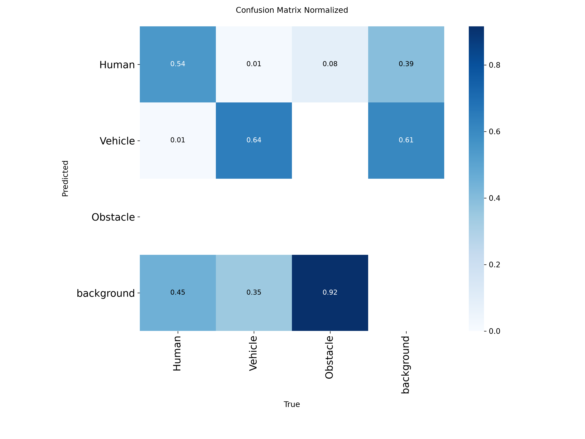

It was inferred that , Per-class analysis reveals the model performs well on Human (61% recall) and Vehicle (71% recall) detection, but exhibits class collapse on 'Obstacle' - the model essentially never predicts this class, likely due to limited/imbalanced training examples combined with high intra-class visual variability (an 'obstacle' can be almost any shape, unlike the more visually consistent Human/Vehicle classes).

 Test-set metrics closely track validation metrics (mAP50: 0.494 test vs. ~0.49 val), confirming the train/val/test split is leak-free and results generalize

### Confidence-threshold sweep

From `python -m src.evaluate` 

<div>
<style scoped>
    .dataframe tbody tr th:only-of-type {
        vertical-align: middle;
    }

    .dataframe tbody tr th {
        vertical-align: top;
    }

    .dataframe thead th {
        text-align: right;
    }
</style>
<table border="1" class="dataframe">
  <thead>
    <tr style="text-align: right;">
      <th></th>
      <th>confidence</th>
      <th>precision</th>
      <th>recall</th>
      <th>mAP50</th>
      <th>mAP50-95</th>
    </tr>
  </thead>
  <tbody>
    <tr>
      <th>0</th>
      <td>0.10</td>
      <td>0.578793</td>
      <td>0.448730</td>
      <td>0.462389</td>
      <td>0.299523</td>
    </tr>
    <tr>
      <th>1</th>
      <td>0.20</td>
      <td>0.555698</td>
      <td>0.466444</td>
      <td>0.434209</td>
      <td>0.287357</td>
    </tr>
    <tr>
      <th>2</th>
      <td>0.25</td>
      <td>0.598618</td>
      <td>0.437334</td>
      <td>0.416737</td>
      <td>0.280228</td>
    </tr>
    <tr>
      <th>3</th>
      <td>0.40</td>
      <td>0.787111</td>
      <td>0.379612</td>
      <td>0.369362</td>
      <td>0.258205</td>
    </tr>
    <tr>
      <th>4</th>
      <td>0.50</td>
      <td>0.957868</td>
      <td>0.335088</td>
      <td>0.330011</td>
      <td>0.238957</td>
    </tr>
    <tr>
      <th>5</th>
      <td>0.60</td>
      <td>0.646557</td>
      <td>0.284172</td>
      <td>0.280618</td>
      <td>0.212270</td>
    </tr>
  </tbody>
</table>
</div>

### Screenshots


<table style="border-collapse: separate; border-spacing: 1px 0;">
  <tr>
    <td>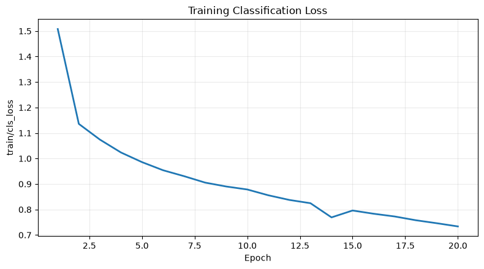</td>
    <td></td>
    <td></td>
  </tr>
  <tr gap = 1>
    <td></td>
    <td>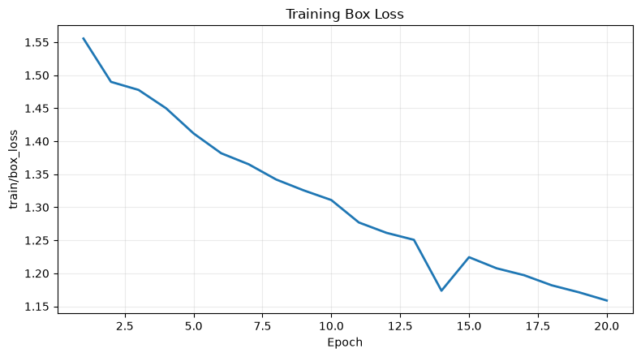</td>
    <td></td>
  </tr>
  <tr>
    <td></td>
    <td></td>
    <td></td>
  </tr>
</table>
<table >
  <tr>
    <td>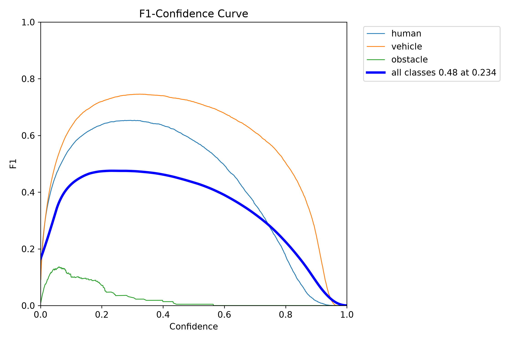</td>
    <td>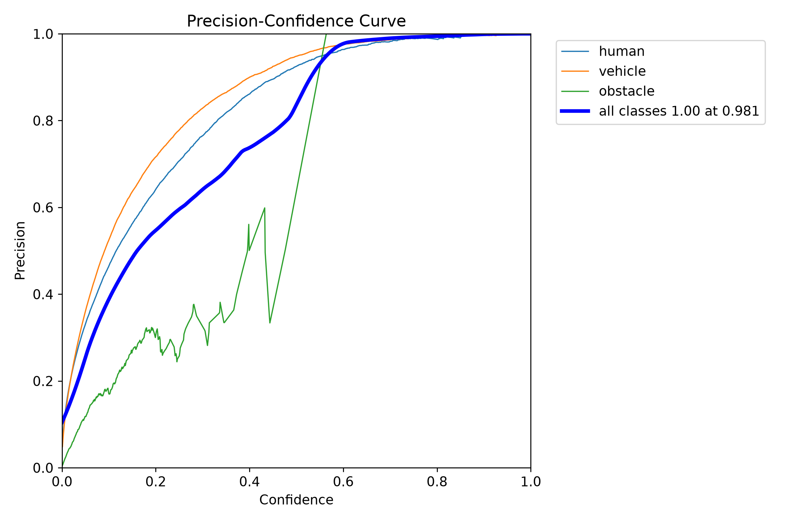</td>
  </tr>
  <tr>
    <td>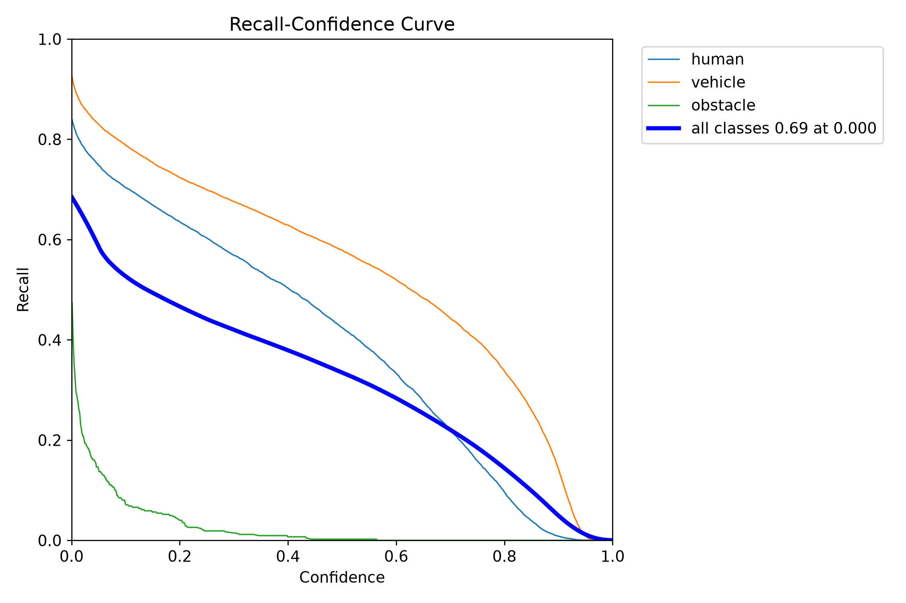</td>
    <td>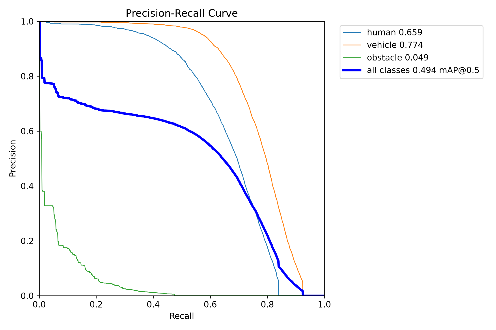</td>
  </tr>
</table>

The model achieved an overall mAP@0.50 of 49.4%, with the best F1-score of 0.48 at a confidence threshold of 0.234. Among the three classes, vehicles performed the best, followed by humans, while obstacle detection still needs improvement.

Overall, the results show that the model is able to detect important objects even in low-visibility conditions, but there is still scope for improving its performance, especially for obstacles. More training data, better-quality foggy images, and further tuning of the model can help improve the detection accuracy and make it more suitable for real-world mining safety applications.

### Baseline vs. fine-tuned comparison 
When the pretrained YOLOv8 model, trained on the COCO dataset, was directly tested on images from the Bailadila mining region, it produced several out-of-class detections. HEMM vehicles and other heavy construction equipment were sometimes incorrectly detected as classes such as boat, airplane, or bridge, since these objects were not represented appropriately in the COCO classes.

After fine-tuning YOLOv8 on the ThroughTheFog dataset and generalizing the target class as “vehicle”, the model was able to better understand the visual characteristics of vehicles in foggy environments. This helped it recognize and generalize HEMM vehicles as vehicles, even though the exact types of mining equipment may not have been present as separate classes in the training data.

## Sharing our trained model

- best .onnx : https://drive.google.com/file/d/1_ZFXYBsUWL3CppvY9bd3cNO3rSXvuFwJ/view?usp=sharing
- best .pt : https://drive.google.com/file/d/17eHbH37dSLPUVo_0rTLFybDmvp8a8CII/view?usp=sharing

## Limitations & honest caveats
- The model was trained with three classes: Human, Vehicle, and Obstacle. The Obstacle class was a very broad category and turned out to be the weakest part of the model. This was also evident in the confusion matrix, where a significant number of obstacles were incorrectly classified as background. Additionally, the number of obstacle instances was considerably lower than that of the Human and Vehicle classes, which affected the model's ability to learn this class effectively.
- The model was trained using the ThroughTheFog dataset, where classes such as bus and car were merged into a generalized Vehicle class. This was done to make the model capable of recognizing a wider range of vehicles, including HEMM and other heavy machinery. There was also an effort to identify and collect HEMM-specific and heavy-vehicle datasets to improve domain representation. However, due to the limited availability of suitable labelled data, the training data could not fully capture the diversity of vehicles encountered in an actual mining environment. Real, labelled data collected directly from the Bailadila mining region would likely provide the most significant improvement, as it would better represent the actual HEMM types, viewpoints, environmental conditions, and fog characteristics encountered during deployment.

## Thank you
